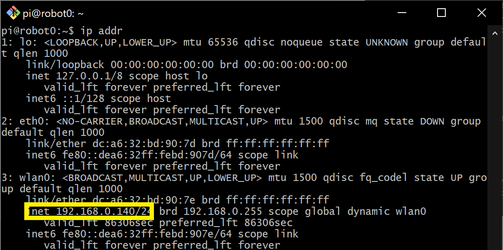

# 🔧 Robot Setup

This guide will walk through the steps to install Ubuntu Server 22.04 LTS, ROS2 Humble, and all dependencies on a Raspberry Pi 4B. This Pi is then embedded within the Robotis TurtleBot3 Burger along with a USB camera. The robotics system, TurtleBot3, is utilized in the United States Air Force Academy's Electrical and Computer Engineering department to teach undergraduate students robotics.  

This guide is adapted from the [TurtleBot3 e-Manual](https://emanual.robotis.com/docs/en/platform/turtlebot3/overview/#overview).

- Created by Steve Beyer, 2022
- Updated by Stan Baek, 2023

---


## TurtleBot3
Below is a list of recommended hardware and links. Other off-the-shelf components can replace the ones below. 

- [TurtleBot3](https://www.robotis.us/turtlebot-3/) 
- [USB Camera](https://www.adesso.com/product/cybertrack-h4-1080p-hd-usb-webcam-with-built-in-microphone/) (Any USB Cam will work, this is the one we use)
- 128 GB High Speed MicroSD card
- Monitor, mouse, and keyboard
- If using an older version of the TurtleBot3 with a Jetson Nano or Raspberry Pi 3B+ you will need ot purchase a [Raspberry Pi 4 Model B](https://www.canakit.com/raspberry-pi-4-8gb.html) (preferably with 8 GB of RAM))


### Hardware Assembly
Follow the [Robotis e-Manual](https://emanual.robotis.com/docs/en/platform/turtlebot3/hardware_setup/#hardware-assembly) for hardware assembly stopping after installing the Raspberry Pi.


### Raspberry Pi
A Raspberry Pi 4 B with 8 GB of RAM is used throughout this curriculum. Ensure heat sinks are propertly installed on the Pi such as these from [CanaKit](https://www.canakit.com/raspberry-pi-4-heat-sinks.html).

Also, a small fan can be installed to help with cooling. We used this 3D printed bracket to mount the fan.

```{image} ./figures/fan.jpg
:width: 380
:align: center
```

### Camera
After installing the Raspberry pi level of the TurtleBot3 you need to install the USB Camera Mount prior to finishing the robot build. The mount used in this course can be found in the [curriculum material](../stl/burger_usbcam_mount.stl) and is installed on two of the front standoffs on the TurtleBot3.

```{image} ./figures/camera_mount.jpg
:width: 280
:align: center
```

## Ubuntu Installation

### Download Ubuntu and flash MicroSD card
There are multiple ways to download and install Ubuntu 22.04.5 to a MicroSD card, but the Raspberry Pi Imager is one of the easiest. Instructions for installing the imager on your operating system can be found on the [Raspberry Pi OS software page](https://www.raspberrypi.com/software/). 

Once installed, start the imager and select "Raspberry Pi 4".
<br>

```{image} ./figures/installer1.png
:width: 480
:align: center
```
<br>
Scroll down the menu and select "Other general purpose OS".

<br>

```{image} ./figures/installer2.png
:width: 480
:align: center
```

<br>

Next, select "Ubuntu".
<br>


```{image} ./figures/installer3.png
:width: 480
:align: center
```

<br>
Lastly, scroll and select the latest 64-bit version of "Ubuntu Server 22.04 LTS (64-bit)".

<br>

```{image} ./figures/installer4.png
:width: 480
:align: center
```
<br>

Now that you have the correct image selected, you need to choose the correct storage device that corresponds to the MicroSD card.

Once complete you should have an Ubuntu SD card! Ensure your Raspberry Pi is powered off, connected to a monitor, keyboard, and mouse, and insert the SD card.


## Configuring Ubuntu

### Login and changing password
Once Ubuntu boots up you will be prompted to enter the login and password. It may take a few minutes on first boot to configure the default username and password, so if login fails, try again after a few minutes. 

### Adding username 
We need to create a new user named *pi* for students.

- Create the *pi* user:
    ```bash
    sudo adduser pi
    ```

    Enter an easy-to-remember password when prompted, then press Enter through the remaining prompts until you return to the terminal.

- Grant *sudo* previleges:
    ```bash
    sudo adduser pi sudo
    ```

- Switch to the new user
    ```bash
    exit
    ```
    Then log in using the *pi* account credentials.

- Once logged in as *pi*, your terminal prompt should show `pi@ubuntu:`. Confirm your current directory by running:
    ```bash
    pwd
    ```
    This should display `/home/pi`.


### Change hostname
If you have multiple robots on your network it is good to give each a unique hostname. We number each robot from 0-n and each robot has a corresponding hostname (e.g., robot0).

Change the hostname with the command line editor of your choice.
```bash
sudo hostnamectl set-hostname robot0
```

The new hostname will not take effect until reboot. Don't reboot yet, though! We have a couple more things to accomplish before reboot.

### Set up Wi-Fi (Optional)
Until a desktop GUI is installed we have to work with the command line to set up the Wi-Fi. This is the most reliable method I have found and we will delete these changes once a GUI is installed.

- First, determine the name of your Wi-Fi network adapter by typing `ip link` (for the Raspberry Pi version of Ubuntu Server 20.04 LTS it is typically **`wlan0`**).

    ```bash
    pi@ubuntu:~$ ip link
    1: lo: <LOOPBACK,UP,LOWER_UP> mtu 65536 qdisc noqueue state UNKNOWN mode DEFAULT group default qlen 1000
        link/loopback 00:00:00:00:00:00 brd 00:00:00:00:00:00
    2: eth0: <NO-CARRIER,BROADCAST,MULTICAST,UP> mtu 1500 qdisc mq state DOWN mode DEFAULT group default qlen 1000
        link/ether e4:5f:01:15:5b:30 brd ff:ff:ff:ff:ff:ff
    3: wlan0: <BROADCAST,MULTICAST,UP,LOWER_UP> mtu 1500 qdisc fq_codel state UP mode DORMANT group default qlen 1000
        link/ether e4:5f:01:15:5b:31 brd ff:ff:ff:ff:ff:ff
    ```

- Open the `/etc/netplan/50-cloud-init.yaml` file in your favorite browser:

    ```bash
    sudo nano /etc/netplan/50-cloud-init.yaml
    ```

- Edit the file so it looks like the below (use spaces and not tabs) replacing **wlan0** with your wireless network interface and using your SSID and password:

    ```
    # This file is generated from information provided by the datasource.  Changes
    # to it will not persist across an instance reboot.  To disable cloud-init's  
    # network configuration capabilities, write a file
    # /etc/cloud/cloud.cfg.d/99-disable-network-config.cfg with the following:    
    # network: {config: disabled}
    network:
        ethernets:
            eth0:
                dhcp4: true
                optional: true
        version: 2
        wifis:
            wlan0:
                optional: true
                access-points:
                    "YOUR-SSID":
                        password: "YOUR-PASSWORD"
                dhcp4: true
    ```

- Save and exit.

- Apply your changes using the following command:
    ```bash
    sudo netplan apply
    ```

    Alternatively, you can reboot your system and the changes will be automatically applied once the system boots.

### Static IP Address (Optional) 
It may be beneficial to setup a static IP address. To do this you need to determine your subnet and gateway.

- Determine subnet and gateway addresses:
    ```
    ubuntu@ubuntu:~$ ip route
    default via 192.168.0.1 dev wlan0 proto static 
    192.168.0.1/24 dev wlan0 proto kernel scope link src 192.168.0.201
    ```

- Set static IP within subnet range:
    ```
    # This file is generated from information provided by the datasource.  Changes
    # to it will not persist across an instance reboot.  To disable cloud-init's  
    # network configuration capabilities, write a file
    # /etc/cloud/cloud.cfg.d/99-disable-network-config.cfg with the following:    
    # network: {config: disabled}
    network:
        ethernets:
            eth0:
                dhcp4: true
                optional: true
        version: 2
        wifis:
            wlan0:
                dhcp4: no
                access-points:
                    "robotics_5GHz":
                        password: "YOUR-PASSWORD"
                addresses:
                    - 192.168.1.208/24
                routes:
                    - to: default
                    via: 192.168.1.1
                nameservers:
                    addresses: [192.168.1.1, 8.8.8.8, 1.1.1.1]
                optional: true
    ```

### Disable Automatic Updates
Ubuntu will attempt to apply system updates in the background. This has caused issues in the past with ROS dependencies and keys. Disabling automatic updates allows you to control when Ubuntu installs updates. While this is not a good habit for general computer security, it is fine for this application of an embedded robotics system. Ensure you periodically update and upgrade your system.

- Open the auto updater configuration file using sudoedit:
    ```bash
    sudoedit /etc/apt/apt.conf.d/20auto-upgrades
    ```

- Change the content from:
    ```
    APT::Periodic::Update-Package-Lists "1";
    APT::Periodic::Unattended-Upgrade "1";
    ```

    to:
    ```
    APT::Periodic::Update-Package-Lists "0";
    APT::Periodic::Unattended-Upgrade "0";
    APT::Periodic::AutocleanInterval "0";
    APT::Periodic::Download-Upgradeable-Packages "0";
    ```

- Set the systemd to prevent boot-up delay even if there is no network at startup. Run the command below to set mask the systemd process using the following command.
    ```
    $ sudo systemctl mask systemd-networkd-wait-online.service
    ```

- Disable Suspend and Hibernation
    ```
    $ sudo systemctl mask sleep.target suspend.target hibernate.target hybrid-sleep.target
    ```

- Reboot the Raspberry Pi.
    ```
    $ sudo reboot
    ```

### Verify changes
- After reboot and you log in your new hostname should be listed at the terminal (e.g., `pi@robot0`). Additionally, you should be connected to Wi-Fi and have an IP Address. You can confirm by typing the following and observing the IP address in the output:

    

- You can now use this IP address to create a remote secure shell into the TurtleBot3 using either the IP address or hostname if your network provides Dynamic DNS. From another machine connected to your network type one of the following:

    ```bash
    ssh username@IP_ADDRESS
    ```
    or
    ```bash
    ssh username@HOSTNAME
    ```


### Update and Upgrade
Since we turned off automatic updates, you should periodically update and upgrade. You can use this single command to accomplish both while accepting all upgrades:

```bash
sudo apt update && sudo apt upgrade -y
```

### Install Ubuntu Desktop (optional)
A desktop GUI is **not** necessary for a remote machine like TurtleBot3 and will take up about 1.4 GB of RAM to run. If GUI is neccessary, the following will install the environment while confirming the installation:

```bash
sudo apt -y install ubuntu-desktop
```

If you do install the Ubuntu Desktop and want to use the GUI to setup the Wi-Fi network then you need to remove the settings included in the `/etc/netplan/50-cloud-init.yaml` file. It should look like the original file when complete:

```
# This file is generated from information provided by the datasource.  Changes
# to it will not persist across an instance reboot.  To disable cloud-init's  
# network configuration capabilities, write a file
# /etc/cloud/cloud.cfg.d/99-disable-network-config.cfg with the following:    
# network: {config: disabled}
network:
    ethernets:
        eth0:
            dhcp4: true
            optional: true
    version: 2
    wifis:
        wlan0:
             dhcp4: true
             optional: true
```

You can now use the GUI interface in the top right of the screen to set up a Wi-Fi connection.


### Install RTL8723BU driver (Ubuntu 22.04)

We use a WiFi dongle to create an access point, allowing a remote master computer to directly control the robot. The specific adapter is the [Xinghuatian Tech Combination WiFi + Bluetooth® 4.0 USB Adapter](https://www.adafruit.com/product/4827?srsltid=AfmBOorWVrVtwi3XuDb8Z2vIOsfrhc-y8ti8qm8orQDFAH0JVqh8e-_I)

- Install build prerequisites

    ```bash
    sudo apt update
    sudo apt install -y git dkms build-essential linux-headers-$(uname -r)
    ```

- Remove any conflicting Realtek modules

    ```bash
    sudo modprobe -r rtw88_8723b 2>/dev/null
    sudo modprobe -r rtl8723bu 2>/dev/null
    ```

    (Optional) Verify no 8723 modules are loaded.

    ```bash
    lsmod | grep 8723
    ```

- Install the RTL8723BU Driver.  The recommended repository is https://github.com/lwfinger/rtl8723bu.git.

    ```bash
    # Clone the repository
    git clone https://github.com/lwfinger/rtl8723bu.git
    cd rtl8723bu

    # Read package info from dkms.conf
    source dkms.conf

    # Create and populate the DKMS source directory
    sudo mkdir -p /usr/src/$PACKAGE_NAME-$PACKAGE_VERSION
    sudo cp -r core hal include os_dep platform dkms.conf Makefile rtl8723b_fw.bin /usr/src/$PACKAGE_NAME-$PACKAGE_VERSION

    # Add and install the DKMS module
    sudo dkms add $PACKAGE_NAME/$PACKAGE_VERSION
    sudo dkms autoinstall $PACKAGE_NAME/$PACKAGE_VERSION
    ```
- Load the module
    ```bash
    sudo modprobe rtl8723bu
    lsmod | grep 8723
    ```
    It should display something like:    
    ```bash
    8723bu               1048576  0
    cfg80211              970752  4 brcmfmac,mac80211,8723bu,rtl8xxxu
    ```

- Rename the interface: Currently, `ip addr` shows the WiFi dongle with varying names (e.g., wlx1cbfcee6196b). We want to standardize this to `wlan1` across all robots.

    Here is the most effective way to ensure that the external dongle is always named `wlan1` across all your Raspberry Pis, regardless of its MAC address. On the Raspberry Pi 4, the built-in WiFi will grab wlan0, and the first USB dongle detected will grab wlan1.

    Edit the boot configuration: On Ubuntu for Raspberry Pi, the kernel boot parameters are stored in a specific text file.

    ```bash
    sudo nano /boot/firmware/cmdline.txt
    ```

    Add naming parameters: Stay on the same line (do not create a new line). Go to the end of the existing text and add a space followed by:

    ```
    net.ifnames=0 biosdevname=0
    ```

    Save and Reboot.  After rebooting, your interfaces will no longer have long names like wlx1cbfcee6196b. Your dongle will almost certainly be wlan1.


## Dual Wi-Fi Setup (Client + Access Point)

In this configuration, the TurtleBot3 uses **two independent Wi-Fi interfaces**:

- One interface connects to an existing Wi-Fi network for **internet access**
- The second interface runs as a **dedicated Access Point (AP)** for direct, low-latency communication with a remote master computer (NUC or laptop)

This design avoids routing complexity and provides a stable ROS2 communication link.

### GOAL (Final Architecture)

| Interface | Hardware                    | Role                      | Network            |
| --------- | --------------------------- | ------------------------- | ------------------ |
| `wlan0`   | Built-in Raspberry Pi Wi-Fi | **Access Point (AP)**     | `robotXX`          |
| `wlan1`   | USB Wi-Fi (RTL8723BU)       | **Wi-Fi client → router** | Router             |
| Master PC | Built-in & USB Wi-Fi        | Connects to AP + Internet | `robotXX` + Router |

- **No NAT or packet forwarding**
- **No NetworkManager**
- Laptop/NUC maintains its own internet connection


### Verify Interfaces

- Confirm that both interfaces exist:

    ```bash
    ip link
    ```

    You are expected:

    ```text
    wlan0   ← built-in Wi-Fi
    wlan1   ← USB Wi-Fi dongle
    ```

- Verify that the RTL8723BU driver is loaded:

    ```bash
    lsmod | grep 8723
    ```

    You should see:

    ```text
    8723bu
    ```


### Configure Wi-Fi Client (Internet) — `wlan1`

This configures the USB WiFi dongle to connect to a 2.4 GHz network for internet access. The built-in 5 GHz adapter will then be available for a direct, high-bandwidth connection to the remote master PC.

- The USB Wi-Fi dongle (`wlan1`) will connect to your router to provide internet access. Edit the Netplan configuration:

    ```bash
    sudo nano /etc/netplan/50-cloud-init.yaml
    ```

    Update it as shown below (replace SSID and password):

    ```yaml
    network:
    version: 2
    ethernets:
        eth0:
        dhcp4: true
        optional: true
    wifis:
        wlan1:
        dhcp4: true
        optional: true
        regulatory-domain: US
        access-points:
            "ECE":
            password: "YOUR_ROUTER_PASSWORD"
    ```

- Fix permissions and apply:

    ```bash
    sudo chmod 600 /etc/netplan/50-cloud-init.yaml
    sudo netplan apply
    ```

- Verify that `wlan1` received an IP address:

    ```bash
    ip addr show wlan1
    ```

    You should see:

    ```text
    inet 192.168.x.x
    ```


### Configure Static IP for Access Point — `wlan0`
The built-in Wi-Fi (`wlan0`) will act as an access point with a **fixed IP address**.

- Edit `dhcpcd`:

    ```bash
    sudo nano /etc/dhcpcd.conf
    ```

    Add the following at the end of the file:

    ```ini
    interface wlan0
    static ip_address=192.168.50.1/24
    nohook wpa_supplicant
    ```

- Restart the service:

    ```bash
    sudo systemctl restart dhcpcd
    ```

---

### Configure DHCP for AP Clients (dnsmasq)
The `dnsmasq` service assigns IP addresses to devices that connect to the robot’s AP.

- Install and configure:

    ```bash
    sudo apt update
    sudo apt install dnsmasq
    ```

- Backup the default configuration:

    ```bash
    sudo mv /etc/dnsmasq.conf /etc/dnsmasq.conf.orig
    sudo nano /etc/dnsmasq.conf
    ```

    Paste:

    ```ini
    interface=wlan0
    bind-interfaces

    # Disable DNS (DHCP only)
    port=0

    # 72-hour lease for student labs
    dhcp-range=192.168.50.10,192.168.50.50,255.255.255.0,72h
    ```

- Enable and restart:

    ```bash
    sudo apt install hostapd
    sudo systemctl enable dnsmasq
    sudo systemctl restart dnsmasq
    ```

### What controls the AP instead

| Component     | Purpose               |
| ------------- | --------------------- |
| `dhcpcd.conf` | Static IP for `wlan0` |
| `dnsmasq`     | DHCP for clients      |
| `hostapd`     | Wi-Fi AP              |
| `systemd`     | Startup ordering      |


### Hostapd Configuration Template
Instead of hard-coding the SSID, we make it **automatically follow the robot hostname**.
This allows you to clone SD cards without manual edits.

- Create the template:

    ```bash
    sudo nano /etc/hostapd/hostapd.conf.template
    ```

    ```ini
    interface=wlan0
    driver=nl80211

    ssid=__HOSTNAME__

    # 5 GHz band
    hw_mode=a
    channel=36
    ieee80211n=1
    ieee80211ac=1
    country_code=US

    # Security
    auth_algs=1
    wpa=2
    wpa_passphrase=dfec3141
    wpa_key_mgmt=WPA-PSK
    rsn_pairwise=CCMP

    ignore_broadcast_ssid=0
    ```

- Create the generator script:

    ```bash
    sudo nano /usr/local/bin/gen-hostapd-conf.sh
    ```

    ```bash
    #!/bin/bash
    HOSTNAME=$(hostname)
    sed "s/__HOSTNAME__/${HOSTNAME}/g" \
        /etc/hostapd/hostapd.conf.template \
        > /etc/hostapd/hostapd.conf
    ```

    Make it executable:

    ```bash
    sudo chmod +x /usr/local/bin/gen-hostapd-conf.sh
    ```


### Systemd Service for Automatic SSID Update

- Edit
    ```bash
    sudo nano /etc/systemd/system/hostapd-genconf.service
    ```

- Add
    ```ini
    [Unit]
    Description=Generate hostapd config from hostname
    Before=hostapd.service

    [Service]
    Type=oneshot
    ExecStart=/usr/local/bin/gen-hostapd-conf.sh

    [Install]
    WantedBy=multi-user.target
    ```

- Enable it:

    ```bash
    sudo systemctl daemon-reexec
    sudo systemctl enable hostapd-genconf.service
    ```


- Tell systemd where hostapd config lives:

    ```bash
    sudo nano /etc/default/hostapd
    ```

    Set:

    ```ini
    DAEMON_CONF="/etc/hostapd/hostapd.conf"
    ```

- Start the access point

    ```bash
    sudo systemctl unmask hostapd
    sudo systemctl enable hostapd
    sudo systemctl enable dnsmasq

    sudo systemctl restart systemd-networkd
    sudo systemctl restart hostapd
    sudo systemctl restart dnsmasq
    ```

- Verify:

    ```bash
    systemctl status hostapd
    ```

    You should see:

    ```text
    AP-ENABLED
    ```

### Disable cloud-init Hostname Reset (IMPORTANT)
By default, **cloud-init resets the hostname on every boot**, which breaks the automatic SSID feature.

- Create the override:

    ```bash
    sudo nano /etc/cloud/cloud.cfg.d/99-disable-hostname.cfg
    ```
   
    ```yaml
    preserve_hostname: true
    ```

- Edit the main config:

    ```bash
    sudo nano /etc/cloud/cloud.cfg
    ```

    Change:

    ```yaml
    preserve_hostname: false
    ```

    to:

    ```yaml
    preserve_hostname: true
    ```


### Final Verification

- After reboot:

    ```bash
    hostname
    ```

    SSID should match hostname (e.g., `robot42`).

- Check interfaces:

    ```bash
    ip addr show wlan0   # 192.168.50.1
    ip addr show wlan1   # Router IP
    ```

- From the master computer:

    ```bash
    ssh pi@192.168.50.1
    ```

## ROS2 Humble
At this point, the Ubuntu environment is setup. Now we will setup the ROS requirements for the TurtleBot3. All of these instructions are adapted from the [ROS2 Documentation](https://docs.ros.org/en/humble/Installation/Ubuntu-Install-Debians.html) and [The Robotics Back-End](https://roboticsbackend.com/install-ros2-on-raspberry-pi/)
. ROS 2 Humble is the latest version of ROS 2 that supports Ubuntu 22.04.

### Installation

Make sure you have a locale which supports UTF-8.

```shell
locale  # check for UTF-8

sudo apt update && sudo apt install locales
sudo locale-gen en_US en_US.UTF-8
sudo update-locale LC_ALL=en_US.UTF-8 LANG=en_US.UTF-8
export LANG=en_US.UTF-8

locale  # verify settings
```

First ensure that the Ubuntu Universe repository is enabled.
```shell
sudo apt install software-properties-common
sudo add-apt-repository universe
```

Set up keys:

```shell
sudo apt update && sudo apt install curl -y
sudo curl -sSL https://raw.githubusercontent.com/ros/rosdistro/master/ros.key -o /usr/share/keyrings/ros-archive-keyring.gpg
```

Then add the repository to your sources list.

```bash
echo "deb [arch=$(dpkg --print-architecture) signed-by=/usr/share/keyrings/ros-archive-keyring.gpg] http://packages.ros.org/ros2/ubuntu $(. /etc/os-release && echo $UBUNTU_CODENAME) main" | sudo tee /etc/apt/sources.list.d/ros2.list > /dev/null

```

Install ROS 2 Humble:

```bash
sudo apt update
sudo apt upgrade
sudo apt install ros-humble-ros-base
```

The base version provides the Bare Bones of ROS 2 to include minimum packaging, build, and communications libraries. No GUI tools are installed. As the Raspberry Pi is embedded into TurtleBot it is ideal to keep overhead as low as possible. Many of the GUI tools will be ran on the main machine.

Install colcon (build tool)

ROS2 uses colcon as a build tool (and ament as the build system). When you only install the ROS2 core packages, colcon is not here, so install it manually.

```bash
sudo apt install python3-colcon-common-extensions
```

### Configuring ROS2 Environment

Ref: https://docs.ros.org/en/humble/Tutorials/Beginner-CLI-Tools/Configuring-ROS2-Environment.html


Setup ROS environment variables and setup scripts within the `~/.bashrc` file. If you don’t want to have to source the setup file every time you open a new shell, then add the command to your shell startup script:

```bash
echo "source /opt/ros/humble/setup.bash" >> ~/.bashrc
```

Any time you make changes to your `~/.bashrc` file you must source it:

```bash
source ~/.bashrc
```

Sourcing ROS 2 setup files will set several environment variables necessary for operating ROS 2. If you ever have problems finding or using your ROS 2 packages, make sure that your environment is properly set up using the following command:

```shell
printenv | grep -i ROS
```

Check that variables like ROS_DISTRO and ROS_VERSION are set.

```shell
ROS_VERSION=2
ROS_PYTHON_VERSION=3
ROS_DISTRO=humble
```

ROS 2 nodes on the same domain can freely discover and send messages to each other, while ROS 2 nodes on different domains cannot. All ROS 2 nodes use domain ID 0 by default. To avoid interference between different groups of computers running ROS 2 on the same network, a different domain ID should be set for each group.  

We can simply choose a domain ID between 0 and 101, inclusive, but for ECE387, we choose X for RobotX and MasterX. Once you have determined a unique integer for your group of ROS 2 nodes, you can set the environment variable with the following command:

```
echo "export ROS_DOMAIN_ID=<your_domain_id>" >> ~/.bashrc
```

### Install and Build ROS2 Packages
This section installs the minimum system, ROS 2, and sensor packages required to run TurtleBot3 on ROS 2 Humble.

- Install the core build tools that are required to compile and build ROS 2 packages using `colcon`.
    ```bash
    sudo apt install python3-argcomplete python3-colcon-common-extensions libboost-system-dev build-essential
    ```

- TurtleBot3 ROS 2 Dependencies: drivers and message definitions for LiDAR, motors, URDF, and USB devices.

    ```bash
    sudo apt install ros-humble-hls-lfcd-lds-driver
    sudo apt install ros-humble-turtlebot3-msgs
    sudo apt install ros-humble-dynamixel-sdk
    sudo apt install ros-humble-xacro
    sudo apt install libudev-dev
    ```

- Create workspace and clone repositories
    ```bash
    $ mkdir -p ~/robot_ws/src && cd ~/robot_ws/src
    $ git clone -b humble https://github.com/ROBOTIS-GIT/turtlebot3.git
    $ git clone -b humble https://github.com/ROBOTIS-GIT/ld08_driver.git
    $ git clone -b humble https://github.com/ROBOTIS-GIT/coin_d4_driver
    ```

- Remove unused navigation packages to reduces build time and memory usage on the Raspberry Pi.
    ```bash
    cd ~/robot_ws/src/turtlebot3
    rm -r turtlebot3_cartographer turtlebot3_navigation2
    ```

- Build and source workspace
    ```bash
    source ~/.bashrc
    cd ~/robot_ws
    colcon build --symlink-install --parallel-workers 1
    echo 'source ~/robot_ws/install/setup.bash' >> ~/.bashrc
    source ~/.bashrc
    ```

### USB Port Setting for OpenCR

    ```bash
    sudo cp `ros2 pkg prefix turtlebot3_bringup`/share/turtlebot3_bringup/script/99-turtlebot3-cdc.rules /etc/udev/rules.d/
    sudo udevadm control --reload-rules
    sudo udevadm trigger
    ```

### LDS Configuration 
The TurtleBot3 LDS has been updated to LDS-02 since 2022. For the Turtlebots we have purchased after 2022, use LDS-02 for the LDS_MODEL.

```{image} ./figures/lds_small.png
:width: 420
:align: center
```

<br>

```
echo 'export LDS_MODEL=LDS-02' >> ~/.bashrc
echo 'export TURTLEBOT3_MODEL=burger' >> ~/.bashrc
```

### Install software for ECE 387

- Install USB camera drivers and OpenCV image support.

    ```bash
    sudo apt install -y python3-pip
    sudo apt install -y ros-humble-usb-cam ros-humble-image-proc
    sudo apt install -y ros-humble-v4l2-camera
    sudo apt install -y python3-opencv ros-humble-cv-bridge
    sudo apt install -y tree
    ```

- Install the common Python libraries used in perception and vision labs.

    ```bash
    pip install "pydantic<2"
    pip install dlib imutils scipy
    ```

- Install Apriltags libraries

    ```bash
    pip install --user scikit-build cmake
    sudo apt install libapriltag-dev python3-dev cmake libatlas-base-dev
    pip install pupil-apriltags
    ```

### Camera Permissions

- Should run this for each user
    ```bash
    sudo adduser $USER video
    ```
    or replace `$USER` with a user ID.
    ```bash
    sudo adduser pi video
    ```

    This allows access to `/dev/video*` devices.

- Then, reboot the system.


### Updating OpenCR firmware
The last step is updating the firmware for the OpenCR controller board.

Ref: https://emanual.robotis.com/docs/en/platform/turtlebot3/opencr_setup/#opencr-setup


- Install required packages on the Raspberry Pi

    ```bash
    sudo dpkg --add-architecture armhf
    sudo apt update
    sudo apt install libc6:armhf
    ```

- Setup the OpenCR model name:
    ```bash
    export OPENCR_PORT=/dev/ttyACM0
    export OPENCR_MODEL=burger
    rm -rf ./opencr_update.tar.bz2
    ```

- Download the firmware and loader, then extract the file:
    ```bash
    wget https://github.com/ROBOTIS-GIT/OpenCR-Binaries/raw/master/turtlebot3/ROS2/latest/opencr_update.tar.bz2
    tar -xvf ./opencr_update.tar.bz2
    ```

- Upload firmware to the OpenCR:
    ```bash
    cd ~/opencr_update
    ./update.sh $OPENCR_PORT $OPENCR_MODEL.opencr
    ```

    A successful firmware upload for TurtleBot3 Burger will look like:

    ```bash
    pi@robot99: ~/Downloads/opencr_update
    $ ./update.sh $OPENCR_PORT $OPENCR_MODEL.opencr
    aarch64
    arm
    OpenCR Update Start..
    opencr_ld_shell ver 1.0.0
    opencr_ld_main
    [  ] file name          : burger.opencr
    [  ] file size          : 136 KB
    [  ] fw_name            : burger
    [  ] fw_ver             : V230127R1
    [OK] Open port          : /dev/ttyACM0
    [  ]
    [  ] Board Name         : OpenCR R1.0
    [  ] Board Ver          : 0x17020800
    [  ] Board Rev          : 0x00000000
    [OK] flash_erase        : 0.95s
    [OK] flash_write        : 1.31s
    [OK] CRC Check          : D92222 D92222 , 0.004000 sec
    [OK] Download
    [OK] jump_to_fw
    ```

- If not successful, attempt the debug methods in the [OpenCR Setup](https://emanual.robotis.com/docs/en/platform/turtlebot3/opencr_setup/#opencr-setup) guide.


## Setup GitHub SSH Keys
The following assumes you already have a GitHub account.

- Create SSH keys to use with your GitHub account by typing the following using the same email as you GitHub login:

    ```bash
    cd
    ssh-keygen -t ed25519 -C "github@email.com"
    ```

    When prompted to "Enter a file in which to save the key", hit **enter**.

- Start the ssh-agent in the background and add your SSH private key to the ssh-agent:

    ```bash
    eval "$(ssh-agent -s)"
    ssh-add ~/.ssh/id_ed25519
    ```

- Open the public key with your favorite command line editor (this is easier to accomplish via an SSH connection from a desktop machine with a GUI so you can copy the public key to your GitHub account).

    ```bash
    nano ~/.ssh/id_ed25519.pub
    ```

    Copy the contents of the file (maximize the window and ensure you copy the entire contents up to the GitHub email).

- Open a web browser and sign in to your GitHub account. In the upper-right corner of any page, click your profile photo, then click **Settings**:

    <br>

    ```{image} ./figures/ssh1.png
    :width: 240
    :align: center
    ```
    <br>

- In the user settings sidebar, click **SSH and GPG keys**:

    <br>

    ```{image} ./figures/ssh2.png
    :width: 240
    :align: center
    ```
    <br>

- Click **New SSH key**:
    <br>

    ```{image} ./figures/ssh3.png
    :width: 640
    :align: center
    ```
    <br>

    In the `Title` field, add a descriptive label for the new key, such as "robot0". Paste your key into the `Key` field (contents of the `.pub` file). Click **Add SSH key**.

## Optional Updates

### Update Alternatives
Python3 is installed in Ubuntu 22.04 by default. Some ROS packages utilize the "python" command instead of "python3" so we need to create a new executable, "/usr/bin/python" that will call the Python3 (basically use the command "python" to call Python3):

```bash
sudo update-alternatives --install /usr/bin/python python /usr/bin/python3 10
```


### [ECE387 Curriculum](https://github.com/AF-ROBOTICS/ece387_curriculum)
```bash
git clone git@github.com:AF-ROBOTICS/ece387_curriculum.git
```

The **ece387_curriculum** package includes all dependencies needed to run the TurtleBot3 nodes. We can automatically install these dependencies using the ROSDEP tool:

```bash
cd ~/robot_ws
rosdep install --from-paths src --ignore-src -r -y
```

This will take a while.

Now we can make and source our workspace:

```bash
cd ~/robot_ws
catkin_make
source ~/.bashrc
```

The last set of dependencies we need to install are Python dependencies. These are listed within our **ece387_curriculum** package and can be installed using the `pip3` tool:

```bash
roscd ece387_curriculum
pip3 install -r requirements.txt
```

> 📝️ **Note:** the "dlib" package will take quite a while to install.


### Add Swap Space (optional)
Since the Raspberry Pi 4B used in our course has 8 GB of RAM, Swap Space might not be necessary.

You can check that there is no active swap using the free utility:

```bash
pi@ubuntu:~$ free -h
               total        used        free      shared  buff/cache   available
Mem:           7.6Gi       201Mi       7.1Gi       3.0Mi       328Mi       7.3Gi
Swap:             0B          0B          0B
```

The **fallocate** program can be used to create a swap:

```bash
sudo fallocate -l 2G /swapfile
```

If it was created correctly, you should see the below:

```bash
pi@ubuntu:~$ ls -lh /swapfile
-rw------- 1 root root 2.0G Aug 19 17:30 /swapfile
```

Make the file only accessible to root by typing:

```bash
sudo chmod 600 /swapfile
```

Verify the permissions by typing the following:

```bash
pi@ubuntu:~$ ls -lh /swapfile 
-rw------- 1 root root 2.0G Aug 19 17:28 /swapfile
Now only root user has read and write flags enabled.
```

You can set the file as swap space by typing the following:

```bash
pi@ubuntu:~$ sudo mkswap /swapfile
Setting up swapspace version 1, size = 2 GiB (2147479552 bytes)
no label, UUID=b5bc4abf-2bce-419e-870d-4d44a7a05778
```

Then turn on the swap file:

```bash
sudo swapon /swapfile
```

To verify that this worked you can type the following:

```bash
pi@ubuntu:~$ sudo swapon --show
NAME      TYPE SIZE USED PRIO
/swapfile file   2G   0B   -2
```

This swap will only last until reboot, so to make it permanent at it to the `fstab` file:

```shell
echo '/swapfile none swap sw 0 0' | sudo tee -a /etc/fstab
```

Now it is time to reboot by typing 

```shell
sudo reboot
```
