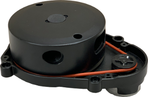

# 🔬 Lab5: Driving the Robot

## 📌 Objectives

- Students should be able to

## 📜 Overview
This In-Class Exercise will introduce you to utilizing pre-built ROS packages to accomplish a task. It will also provide you experience interacting with someone else's source code (.py files) to learn how that component works. You will use ROS to run two nodes, **turtlebot3_core** and **teleop_twist_keyboard**, to drive the Turtlebot3 with a keyboard. You will continue to practice using ROS tools to observe how these components communicate.


## 💻 Lab Procedure

### Working with a Remote Machine

In this course, you'll drive your TurtleBot without the need for a monitor and keyboard. However, you'll still need access to the Raspberry Pi on the robot to run ROS nodes. One of the easiest ways to remotely access a Linux machine is through a secure shell (SSH). To create an SSH connection, you'll need the username and hostname (or IP address) of the computer you want to access. For the Raspberry Pis, the username is `pi` and the hostname is your robot number (e.g., `robot98`).

1. **Connect to the Robot's Wi-Fi Network**:
    - Click the system menu in the top-right corner to open the Wi-Fi Networks setting.
    - Choose `RobotXX`, where `XX` corresponds to the `XX` in `MasterXX`.

    ```{image} ./figures/Lab5_ConnectToRobotWifi.png
    :width: 420
    :align: center
    ```
    <br>
    
1. **Check Connectivity**:
    - The Raspberry Pi on your robot acts as a Wi-Fi access point (AP), allowing communication with your master computer.
    - Open a terminal on your master computer.
    - Check connectivity to the robot using its IP address, `192.168.4.1`:
      ```sh
      ping 192.168.4.1
      ```

1. **Create a Secure Shell Connection**:
    - To access the robot remotely, create an SSH connection:
      ```sh
      ssh pi@192.168.4.1
      ```
      > ⌨️ **Syntax:** `ssh <username>@<hostname/IP address>`

1. **Enter the Robot's Password**:
    - After entering the robot's password, the terminal should display the `pi` username and your robot's hostname, `robotX`. Any commands you run in this shell will execute on the robot.

1. **Edit the `.bashrc` File**:
    - Open the `.bashrc` file by running the following command:
      ```sh
      nano ~/.bashrc
      ```   
   - You should see the following lines at the bottom of the `.bashrc` file:
      ```bash
      source /opt/ros/humble/setup.bash
      source ~/robot_ws/install/setup.bash
      source /usr/share/colcon_cd/function/colcon_cd.sh
      export ROS_DOMAIN_ID=0  # For master0 and robot0
      export _colcon_cd_root=/opt/ros/humble/
      export TURTLEBOT3_MODEL=burger
      export LDS_MODEL=LDS-01  # Replace with LDS-02 if using new LIDAR
      source /usr/share/colcon_argcomplete/hook/colcon-argcomplete.bash
      ```
    - Your `ROS_DOMAIN_ID=XX` should match your computer ID, where `XX` corresponds to the `XX` in `MasterXX`.

    - The robots for our class have two different LIDAR variants: LDS-01 and LDS-02 (pictured below).

        <div style="display: flex; justify-content: center; text-align: center;">
            <div style="margin-right: 10px;">
                
                <p style="text-align: center;">LDS-01</p>
            </div>
            <div>
                
                <p style="text-align: center;">LDC-02</p>
            </div>
        </div>

    - If you have the LDS-02, update `export LDS_MODEL=LDS-01` to `export LDS_MODEL=LDS-02` inside the `.bashrc` file.

    - Save the changes and exit the editor.
    
1. **Close the SSH Connection**:
    - You can type `exit` to close the SSH connection.


### Updating the Hosts File

As it is much easier to remember and use the host name than the IP address, let's modify the `hosts` file so that the master computer recognizes the host name of the Raspberry Pi.

1. **Update the Hosts File**

    - To add the robot's IP address to the hosts file, follow these steps on the master computer:
      ```sh
      sudo gedit /etc/hosts
      ```
    - Add the following line to the file:
      ```sh
      192.168.4.1    robotXX
      ```
    - Replace `robotXX` with your specific robot number.

1. **Save and Close the Hosts File**:
    - Save the changes and close the file by pressing `Ctrl+X`, then `Y` to confirm, and `Enter` to exit.

1. **Check Connectivity**:
    - Check connectivity to the robot using its host name, `robotXX`:
      ```sh
      ping robotXX
      ```

1. **Create a Secure Shell Connection**:
    - To access the robot remotely, create an SSH connection:
      ```sh
      ssh pi@robotXX
      ```
      > ⌨️ **Syntax:** `ssh <username>@<hostname/IP address>`

1. **Enter the Robot's Password**:
    - After entering the robot's password, the terminal should display the `pi` username and your robot's hostname, `robotXX`. 


> 📝️ **Note:** At times, there may be network issues and name resolution will fail. What this means is if you try to ping the robot from the master or vice versa using the hostname (e.g., `ping master0`) it will not work. However, it will work if you use the IP address (e.g., `ping 192.168.2.120`). To do this, you need the IP address of the machine you want to access. This IP address will change periodically. The easiest way to determine the current IP Address is, with the machine plugged into a monitor and keyboard, type `ip addr` in a terminal. This will list all of the network interfaces on the machine (such as *eth0* for ethernet and *wlan0* for wireless). You are looking for the `inet` field under `wlan0` (may be called `wlo1`). Now you can unplug the roobt from the monitor, ping the IP address to check connectivity, and then SSH into the robot.

The other remote tool you may want to take advantage of is SCP, which securely copies a file to a remote machine.

> ⌨️ **Syntax:**  `scp <src location> <username>@<hostname>:<dest location>`

For example, copy the `move_turtlebot_square.py` file to your robot by typing the following in a new terminal on the master:

`roscd module02/my_scripts`

`scp move_turtlebot_square.py pi@robot0:/home/pi/robot_ws/src/ece387_robot_sp23-USERNAME/robot/module02/src/`

> 📝️ **Note:** The destination uses the absolute path you printed earlier.

In your secure shell list the contents of your 'my_scripts' folder. You should see the `move_turtlebot_square.py` file. Check that it is executable. If it is not, make it executable.

Now let's move our TurtleBot using the script on the robot:

1. Run roscore on the master.

1. Run the simulated robot on the master.

1. SSH into your robot Raspberry Pi.

1. Run the move_turtlebot_square.py using the `rosrun` command on the robot.

You are now controlling your simulation (which is running on the master) remotely from the robot. In future lessons you will have nodes running on your robot to drive the robot and will control the robot remotely from the master.


## Code used to drive the robot

1. On the Master, open a terminal and run **roscore**.

1. Open a new terminal on the Master and create a secure shell into the Turtlebot3 using the SSH command you learned during Module 2. This will allow you to run commands as if you were on the Turtlebot3.

1. Using the secure shell, open the source code for the **turtlebot3_core** launch using the nano command line editor tool through the rosed command:

    ```bash
    $ rosed turtlebot3_bringup turtlebot3_core.launch
    ```

    > ⌨️ **Syntax:**  `rosed <package> <filename>`

    ```{note} 
    You may remember when we set up our *.bashrc* file we set the system variable **EDITOR** to `nano -w`. This enables the `rosed` command to utilize the nano editor.
   ```
   
    We will learn more about launch files in a few modules, but just understand that a launch file is used to launch one or more ROS nodes. This particular launch file only launches one node, **serial_node.py**. This node will connect to the OpenCR controller on the Turtlebot3 using the port and baud rate parameters. This connection will enable us to send *Twist* messages over the **/cmd_vel** topic to drive the Turtlebot3 using the keyboard.

1. Close the editor by hitting `ctrl+x`.

1. It is always a good idea to check that the Turtlebot3 is communicating with the Master. To do this, we can list the active topics the Turtlebot3 sees. Run the following within your secure shell:

    ```bash
    $ rostopic list`
    ```
    
    If all is well, then there should be two topics provided by **roscore** running on the Master: **/rosout** and **/rosout_agg**. We will typically ignore these topics.

1. Run the **turtlebot3_core.launch** file using the `roslaunch` command:

    ```bash
    $ roslaunch turtlebot3_bringup turtlebot3_core.launch`
    ```

    > ⌨️ **Syntax:** `roslaunch <package> <launchfile>`
    
    Your Turtlebot3 is now ready to drive and should be listening for *Twist* messages to be sent over the **/cmd_vel** topic.

## Driving the robot
1. Open a new terminal on the Master and observe the nodes currently running:

    `rosrun rqt_graph rqt_graph`
    
    You should only see one node running right now, **turtlebot3_core**, with no connections.
    
1. Open a new terminal tab and list the active topics. There should be one active topic other than the ones created by **roscore**: **/cmd_vel**.

1. We used the **/cmd_vel** topic when driving the simulated Turtlebot3, but let's refresh our memory about the topic:

    `rostopic info cmd_vel`
    
    As you can see the **/cmd_vel** topic is currently subscribed to by the **turtlebot3_core** with no publishers (just as we would expect after seeing the rqt_graph). We also note that topic utilizes the *Twist* message type. The following will show information about the fields within the *Twist* message sent over the **/cmd_vel** topic:
    
    `rostopic type cmd_vel | rosmsg show`

1. You can find information about pre-built packages by googling the package name along with the ROS distribution. Open up your favorite browser and google "teleop twist keyboard noetic". The first result should be from the ROS wiki page.

1. Ensure the ROS package **teleop_twist_keyboard** is installed on your Master:

    `rospack find teleop_twist_keyboard`
    
    If installed, the command should return the absolute path to the package, similar to `/opt/ros/noetic/share/teleop_twist_keyboard`
    
    If the command instead returns an error, then you need to install the package using apt:
    
    `sudo apt install ros-noetic-teleop-twist-keyboard`
    
    ```{tip}
    All packages built for Noetic can be downloaded in the above manner (ros-noetic-desired-pkg with underscores in the package name replaced by dashes). Some packages were only built for previous ROS distribution and will have to be built from source (we will demonstrate this at a future time).
    ```
    
1. Run the **teleop_twist_keyboard** node on the Master:

    ```{tip}
    Don't forget your tab completion! You can start typing a package name or node and then hit tab for it to complete the command for you!
    ```
    
    `rosrun teleop_twist_keyboard teleop_twist_keyboard.py`
    
1. Before we get too excited and drive the Turtlebot3 off a cliff, observe how the nodes communicate using the **rqt_graph** tool in a new terminal (if you still have the previous rqt_graph running, you can hit the refresh button in the top left corner).

1. Select the terminal that has the **teleop_twist_keyboard** node running and observe the instructions for sending *Twist* messages. These are the same as when driving the simulated Turtlebot3.

1. The Turtlebot3 operates best with a linear velocity between 0.2 m/s and 0.5 m/s. It turns best with an angular velocity between 0.5 rad/s and 1.5 rad/s. Drive the Turtlebot3 using these parameters.

## ROS

In labs throughout this course we will request information about the topics, nodes, and messages within your system. Accomplish the following in a new terminal on your Master (you can ignore all nodes/topics that result from **roscore**).

1. List all running nodes.

1. Determine what topics the nodes subscribe and publish to (repeat for each node).

1. Display running nodes and communication between them.

1. List the active topics.

1. Determine the type of messages sent over the topics (repeat for each topic).

1. Determine the fields of the messages.

1. Observe the information sent over a topic (repeat for each topic).

## Checkpoint
Once complete, push screenshots showing the output of each of the above to your student repo on github in a /master/module04 folder.

## Summary
In this exercise you examined and used pre-built packages and source code to drive the Turtlebot3 and understand how the system worked. You then were able to analyze the topics, nodes, and messages within the ROS system to better understand the flow of information and control. The **pro-tips** presented throughout this exercise will make you a better user of Linux and ROS.

## Cleanup
In each terminal window, close the node by typing `ctrl+c`. Exit any SSH connections. 


## Lesson Objectives:
1. Gain additional familiarity with simulation environment
1. Gain familiarity with Turtlebot 3 robotics platform
1. Practice with ROS diagnostic tools

## Agenda:
1. Use Linux terminals to launch and control Turtlebot 3 in simulation environment.
1. Use Linux terminals to launch and control actual Turtlebot 3.


```{tip} 
I strongly recommend that you commit the above sequence of commands to memory, or at a minimum
have them in a place that you can quickly recall them. There is nothing until Module 9 that absolutely requires the real robot, as everything else can be simulated.
```

## Gain Familiarity with Turtlebot3 Robotics Platform.
The Module04 Jupyter Notebook will guide you through the process of connecting to and activating your
robot for the first time.

1. On the master, open the Jupyter Notebook server (if it is not already open):
```bash
$ cd ~/master_ws/src/ece387_lastname/Module04_DrivingTheRobot
```

2. Open ICE4: Driving the Robot and follow the instructions.

## Assignments.
- Complete ICE4 if not accomplished during class.
- Push screen captures into your repo/master/module04 on github

## Next time.
- Lesson 10: Module 5 - Custom Messages


