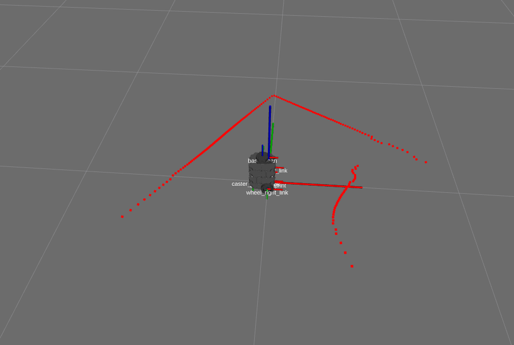

# 🔬 Lab8: LIDAR

**Not ready yet**


## 📌 Objectives
- Students should be able to implement a ROS2 node for detecting walls using LiDAR data, visualize the detected walls in RViz, and test the implementation using Gazebo.


## 📜 Overview

In this lesson we will enable the robot to avoid obstacles. Many sensors provide obstacle avoidance capabilities: camera, sonar, infrared, LIDAR, etc. All of these will work to enable the robot to avoid obstacles, but we will use LIDAR as it is an affordable, but very capable solution.

## LIDAR
[Robotis's LDS-01](https://www.robotis.us/360-laser-distance-sensor-lds-01-lidar/) is a 360 deg Laser Distance Sensor (LDS). It is based on laser triangulation ranging principles and uses high-speed vision acquisition and processing hardware. It measures distance data in more than 1800 times per second. It has a detection range between .12 m and 3.5 m and an angular resolution of 1 degree. The distance accuracy is .015 m between .12 m and .499 m then +/- 5% up to 3.5 m.

```{image} ./figures/rplidar.png
:width: 300  
:align: center  
```  


### Videos:
[Airborne LiDAR](https://www.youtube.com/watch?v=EYbhNSUnIdU)

[Turtlebot3 LDS](https://www.youtube.com/watch?v=9oic8aT3wIc&t)


## Setup
The [hls_lfcd_lds_driver](http://wiki.ros.org/hls_lfcd_lds_driver) package enables data to be received from the LIDAR over the **/scan** topic. The package is pre-installed on your **Robot**, but as always, trust, but verify. Open a new secure shell into your **Robot** and run the following:

```bash
rospack find hls_lfcd_lds_driver
```

If installed, the command should return the absolute path to the package, similar to:

```bash
/opt/ros/noetic/share/hls_lfcd_lds_driver
```

If the command instead returns an error, then you need to install the package.

```bash
sudo apt install ros-humble-hls-lfcd-lds-driver
```

## Testing LIDAR
Open a new terminal on the master and run roscore and setup for statistics:

```bash
roscore
rosparam set enable_statistics true
```

Select the terminal with the secure shell connection to your **Robot** and open the `turtlebot3_lidar.launch` file:

```
rosed turtlebot3_bringup turtlebot3_lidar.launch
```

We can see that this launch file is pretty simple and only launches the **hls_laser_publisher** node.

Run the launch file on the **Robot**:

```bash
roslaunch turtlebot3_bringup turtlebot3_lidar.launch
```

In a new terminal on the **Master**, we can visualize the Turtlebot3 and LIDAR data using another launch file from the Turtlebot3:

```bash
roslaunch turtlebot3_bringup turtlebot3_model.launch
```

This should open an RVIZ window where we can visualize ROS components of our system. In the "Displays" menu on the left you should see two submenus of interest: "LaserScan" and "RobotModel". These allow us to depict the Turtlebot3 and LIDAR data.

You should see red dots fill the **rviz** map where obstacles exist as shown below.




Investigate what data the **hls_laser_publisher** is sending. Type the following and observe the command output:

```bash
rostopic list
rostopic info /scan
rostopic type /scan
rostopic type /scan | rosmsg show
rostopic echo /scan
```

At this point you can kill all nodes on the master, but keep the **turtlebot3_lidar** launch file running on the **Robot**.

## LIDAR Subscriber
In this section we will build a subscriber that will print the range data from the Turtlebot3 LIDAR.

1. Browse to a terminal on the **Master** and create an `ice8` package:
    ```bash
    cd ~/master_ws/src/ece387_master_sp2X-USERNAME/master
    catkin_create_pkg ice8 rospy sensor_msgs geometry_msgs turtlebot3_bringup
    cd ~/master_ws
    catkin_make
    source ~/.bashrc
    ```

1. Create an lidar node:

    ```bash
    roscd ice8/src
    touch lidar_sub.py
    ```
    
1. Copy and complete the below code using the GUI editor tool, **Atom**. Browse to the subscriber you just created and double-click. This will open the file in **Atom** (if it is open in any other editor, stop, raise your hand, and get help from an instructor)
> 💡️ **Tip:** Look for the **"TODO"** tag which indicates where you should insert your own code.

The code should obtain the list of range data from the LIDAR launch file running on the robot, convert the angles from 0 to 180 degrees and 0 to -180 degrees to 0 to 360 degrees. Lastly, the subscriber will print the average distance of obstacles 30 degrees off the nose of the robot.

```python
#!/usr/bin/env python3
import rospy, math
# TODO: import correct message


# lambda function to convert rad to deg
RAD2DEG = lambda x: ((x)*180./math.pi)
# convert LaserScan degree from -180 - 180 degs to 0 - 360 degs
DEG_CONV = lambda deg: deg + 360 if deg < 0 else deg

class LIDAR:    
    """Class to read lidar data from the Turtlebot3 LIDAR"""
    def __init__(self):
        # TODO: create a subscriber to the scan topic published by the lidar launch file

        
        self.ctrl_c = False
        rospy.on_shutdown(self.shutdownhook)
        
    def callback_lidar(self, scan):
    	if not self.ctrl_c:
	    	degrees = []
	    	ranges = []
	    	
	    	# determine how many scans were taken during rotation
	        count = len(scan.ranges)

	        for i in range(count):
	            # using min angle and incr data determine curr angle, 
	            # convert to degrees, convert to 360 scale
	            degrees.append(int(DEG_CONV(RAD2DEG(scan.angle_min + scan.angle_increment*i))))
	            rng = scan.ranges[i]
	            
	            # ensure range values are valid; set to 0 if not
	            if rng < scan.range_min or rng > scan.range_max:
	                ranges.append(0.0)
	            else:
	            	ranges.append(rng)
	        
	        # python way to iterate two lists at once!
	        for deg, rng in zip(degrees, ranges):
	        	# TODO: sum and count the ranges 30 degrees off the nose of the robot
                
                
            # TODO: ensure you don't divide by 0 and print average off the nose
	        	
            
	def shutdownhook(self):
		print("Shutting down lidar subscriber")
		self.ctrl_c = True
        
if __name__ == '__main__':
    rospy.init_node('lidar_sub')
    LIDAR()
    rospy.spin()
```

4. Save, exit, and make the node executable.

4. Open a new terminal on the **Master** and run the **lidar_sub.py** node.

4. Rotate the **Robot** and observe the distance off the nose.

## Checkpoint
Once complete, get checked off by an instructor showing the output of your **lidar_sub** and **rqt_graph** node.

## Summary
In this lesson you learned how to integrate the LIDAR and get the distance of objects off the nose of the robot using the pre-built LIDAR package. In the lab that corresponds to this lesson you will apply this knowledge to stop the robot a specified distance from an obstacle and turn.

## Cleanup
In each terminal window, close the node by typing `ctrl+c`. Exit any SSH connections. Shutdown the notebook server by typing `ctrl+c` within the terminal you ran `jupyter-notebook` in. Select 'y'.

**Ensure roscore is terminated before moving on to the lab.**


## 🌱 Pre-Lab: Testing the IMU  

### Launch File

Large applications in robotics typically involve several interconnected ROS nodes, each of which have many parameters. Your current setup is a good example: as you experienced in the IMU lab, you had to open 3 different terminals to run all of the nodes necessary for our system to that point:


This problem is only going to get more complex as we add additional functionality to our robot. As it stands right now, every node requires a separate terminal window and the associated command to run it. Using the *roslaunch* tool, we can eliminate that administrivia of running each node separately. We will create/edit two launch files to bring up the nodes on the master and robot.

## [roslaunch](http://wiki.ros.org/roslaunch)
The *roslaunch* tool is used to launch multiple ROS nodes locally and remotely via SSH. We can run nodes that we have created, nodes from pre-built packages, and other launch files. The roslaunch tool takes in one or more XML configuration files (with the .launch extension) that specify the parameters to set and nodes to launch.

A launch file is an XML document which specifies:
- which nodes to execute
- their parameters
- what other files to include

An XML file stands for Extensible Markup Language (XML). This is a markup language that defines a set of rules for encoding documents in a format that is both human-readable and machine-readable. That isn't necessarily important for this class, but you can read about XML on Wikipedia if you are interested.

We will then use a tool embedded within ROS called *roslaunch* to easily launch multiple nodes or even other launch files.

By convention, we will give our launch files the *.launch* extension and store them in a *launch* folder within our package. This isn't required, but it is the common convention.


This will create a launch file that starts both the `lab4_gamepad` gamepad node and the `joy` package's `joy_node`.

---

1. **Navigate to Your Package**: Open a terminal and navigate to the `lab4_gamepad` package.

1. **Create a Launch Directory**: Create a `launch` directory:
    ```bash
    mkdir -p launch
    ```

1. **Create the Launch File**: Inside the `launch` directory, create a new Python launch file named `gamepad_launch.py`:
```bash
touch launch/gamepad_launch.py
```

1. Now open this file with VS Code:

1. **Write the Launch File**: Copy and paste the following ROS2 launch file code:

    ```python
    import launch
    import launch_ros.actions

    def generate_launch_description():
        """
        Generate the launch description to run the gamepad node from lab4_gamepad
        and the joy_node from the joy package.
        """
        return launch.LaunchDescription([
            # Start the joy_node from the joy package
            launch_ros.actions.Node(
                package='joy',
                executable='joy_node',
                name='joy_node',
                output='screen'
            ),
            
            # Start the gamepad node from lab4_gamepad
            launch_ros.actions.Node(
                package='lab4_gamepad',  # Change this if your package name is different
                executable='gamepad',  # Change this if your node executable has a different name
                name='gamepad_node',
                output='screen'
            ),
        ])
    ```


## **Step 5: Modify CMakeLists.txt**
Open your `CMakeLists.txt` file:
```bash
nano CMakeLists.txt
```
Scroll to the bottom and **add the following line** to install the launch file:

```cmake
install(DIRECTORY launch
  DESTINATION share/${PROJECT_NAME}
)
```

Save and exit.


## **Step 6: Modify package.xml**
Ensure your `package.xml` includes a dependency for `launch` and `launch_ros`. Open the file:
```bash
nano package.xml
```
Find the `<depend>` section and make sure you have these lines:
```xml
<depend>launch</depend>
<depend>launch_ros</depend>
```

Save and exit.

---

## **Step 7: Build the Package**
Go back to the root of your workspace and build your package:
    ```bash
    ccbuild --packages-select lab4_gamepad
    ```


## **Step 8: Run the Launch File**: Now, you can run your new launch file:
    ```bash
    ros2 launch lab4_gamepad gamepad_launch.py
    ```
    This should start both:
    - The `joy_node` from the `joy` package (which reads gamepad inputs)
    - The `gamepad` node from `lab4_gamepad`


## **(Optional) Step 9: Verify with `ros2 topic list`**
    Run:
    ```bash
    ros2 topic list
    ```
    You should see topics like:
    ```
    /joy
    ```
    which confirms that `joy_node` is running.


1. Use the following command to install necessary Python dependencies if not already installed:
    ```bash
    pip install numpy scikit-learn
    ```

1. Add Gazebo simulation files


## 💻 Lab Procedure

### **LiDAR-Based Wall Detection**

1. **Navigate to Your Workspace:** Open a terminal and move into the `ece387_ws` directory within your ROS2 workspace:
   ```bash
   cd ~/master_ws/src/ece387_ws
   ```
1. **Create a New ROS2 Package:** Create a new package named `lab8lidar` with the BSD-3 license:

1. Download the [`wall_detector.py`](../files/wall_detector.py) and [`line_follower.py`](../files/line_follower.py) files and save them in the `lab8_lidar` Python script directory:

1. **Add Dependencies:** Edit `package.xml` to include the following dependencies:
    ```xml
    <depend>rclpy</depend>
    <depend>sensor_msgs</depend>
    <depend>geometry_msgs</depend>
    <depend>nav2_msgs</depend>
    <depend>tf2_ros</depend>
    <depend>visualization_msgs</depend>
    <depend>numpy</depend>
    <depend>scikit-learn</depend>
    ```

1. **Modify `setup.py`**: Open the `setup.py` script and update the `entry_points` section to include the wall_detector and line_follower nodes.

1. Open the `wall_detector.py` script and complete it as instructed in the comments.

1. **Build the Package**: Return to the ROS2 workspace root and build the package or simply run `ccbuild`

1. **Launch Gazebo with TurtleBot3 and LiDAR**: Start the TurtleBot3 simulation:
    ```bash
    ros2 launch turtlebot3_gazebo square_path.launch.py
    ```

1. **Run RViz for Visualization**: In a new terminal, launch RViz:
    ```bash
    ros2 launch turtlebot3_bringup rviz.launch.py
    ```

1. Unselect `tf` and 

1. Click the `Add` button at the bottom left of the RViz window, click the `By Topics` tab, and select both

1. **Run the Wall Detection Node**: Run the node to process LiDAR data:
    ```bash
    ros2 run lab8_lidar wall_detector
    ```

1. **Observe wall detection in RViz**: 

1. Debug using:
   ```bash
   ros2 run lab8_lidar wall_detector --ros-args --log-level debug
   ```


